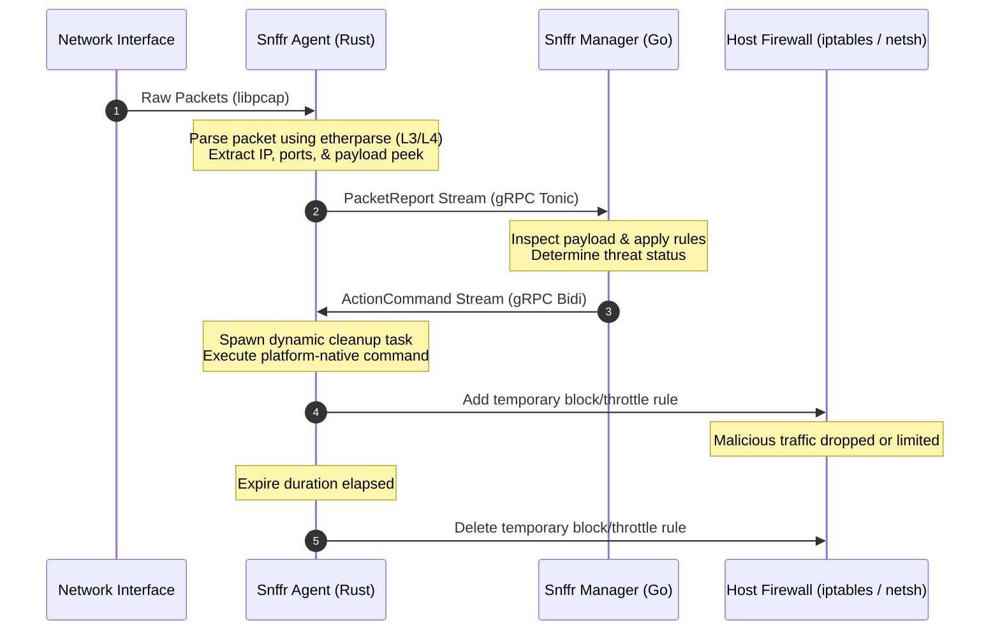

# snffr
### **High-Performance Distributed IDS & Autonomous Response System**

[](https://www.rust-lang.org/)
[](https://go.dev/)
[](https://grpc.io/)
[](https://www.docker.com/)

`snffr` (Sniffer) is a distributed network security system designed to capture network traffic at the edge, analyze it centrally, and execute automated, host-level threat mitigation responses in real-time.

---

## System Architecture

`snffr` utilizes an asynchronous client-server architecture designed for sub-millisecond response loops:



---

## Key Features

- **Distributed Sniffing Agents:** Lightweight edge clients written in **Rust** running synchronously on network interfaces in promiscuous mode with Berkeley Packet Filters (BPF).
- **Centralized Go Manager:** A highly concurrent **Go** manager orchestrating agent reports and managing security logic.
- **Bi-Directional Streaming:** Powered by **gRPC** (`tonic` in Rust, `grpc-go` in Go) with long-lived streaming channels to feed metrics and execute mitigations instantly.
- **Autonomous Countermeasures:** Real-time system calls to add temporal firewall blocks and bandwidth QoS throttling.
- **Cross-Platform Compatibility:**
  - **Linux:** Native `libpcap` capture and `iptables` dynamic drop/rate-limit rules.
  - **Windows:** Native packet capturing, `netsh advfirewall` blocks, and PowerShell QoS traffic throttling.

---

## Repository Structure

```tree
.
├── agent/                  # Rust Edge Sniffing Agent
│   ├── src/
│   │   ├── main.rs         # Agent Orchestration & gRPC loop
│   │   ├── linux_capture.rs# Linux pcap implementation
│   │   ├── win_capture.rs  # Windows packet capture
│   │   ├── parser.rs       # Layer 3 / 4 packet parsing via etherparse
│   │   └── responder.rs    # Threat mitigation responder
│   └── Dockerfile          # Multi-stage container for Rust agent
├── manager/                # Go Orchestrator & Central Manager
│   ├── internal/           # Manager gRPC server & routing internals
│   ├── main.go             # Entrypoint for gRPC listener
│   └── Dockerfile          # Multi-stage container for Go manager
├── proto/                  # Protobuf contract definitions
│   └── snffr.proto         # PacketReport & ActionCommand schemas
├── tests/                  # Threat testing & simulation utils
│   └── scripts/
│       └── attack_sim.py   # Simulates anomalous UDP/TCP traffic
└── docker-compose.yml      # Complete stack orchestration setup
```

---

## Quick Start

### 1. Run using Docker Compose

Deploy the entire stack with a single command. The agent runs with host networking and kernel capabilities (`NET_ADMIN`, `NET_RAW`) to perform network sniffing and block rules:

```bash
docker-compose up --build
```

### 2. Manual Setup (Running Locally)

#### Prerequisites
- **Rust Compiler** (v1.85+)
- **Go compiler** (v1.26+)
- **Protobuf Compiler** (`protoc`)
- **System Libraries:**
  - Linux: `libpcap-dev`, `iptables`
  - Windows: Npcap / WinPcap driver installed in WinPcap API-compatible mode

#### Step A: Start the Go Manager
```bash
cd manager
go run main.go
```
The manager will boot and listen for agents on port `50051`.

#### Step B: Start the Rust Agent (Requires elevated privileges)
```bash
cd agent
# Linux (Sudo is required for raw sockets and iptables modifications)
sudo cargo run

# Windows (Run command prompt / powershell as Administrator)
cargo run
```

---

## Response Actions Reference

When the manager identifies malicious activity, it streams an `ActionCommand` containing an IP, duration, and limit. The agent dynamically schedules:

| Platform | Action | Command Used | Cleanup Mechanism |
| :--- | :--- | :--- | :--- |
| **Linux** | **BLOCK** | `iptables -A INPUT -s <IP> -j DROP` | Async task runs `iptables -D INPUT ...` |
| **Linux** | **RATE_LIMIT** | `iptables -A INPUT -s <IP> -m limit --limit <PPS>/s -j ACCEPT` | Async task removes accept and drop rules |
| **Windows** | **BLOCK** | `netsh advfirewall firewall add rule ...` | Async task runs `delete rule` |
| **Windows** | **RATE_LIMIT** | `New-NetQosPolicy -ThrottleRateActionBitsPerSecond ...` | Async task runs `Remove-NetQosPolicy` |

---

## Roadmap
- [ ] **Configurable Rule Engine:** Add support for Snort-like packet signatures.
- [ ] **eBPF Integration:** Implement XDP/eBPF kernel-level capture bypasses for ultra-low overhead on Linux.
- [ ] **Dashboard TUI:** Terminal UI interface on the manager to watch real-time packet ingress and alerts.
- [ ] **Dynamic Attack Graphing:** Visualize attack vectors in dashboard view.